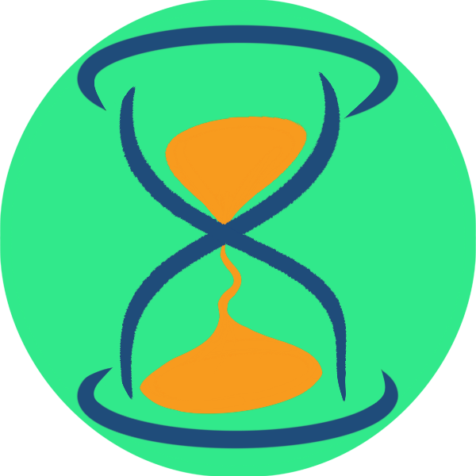

# Toggl Track client

[](./LICENSE)
[](https://github.com/sterliakov/toggl/actions/workflows/ci.yaml?query=event%3Apush)
[](https://renovatebot.com/)
[](https://github.com/sterliakov/toggl/releases/latest)
[](https://crates.io/crates/toggl-tracker)
[](https://www.npmjs.com/package/@sterliakov/toggl-tracker)



## Disclaimer

This project is built solely by me with no affiliation with Toggl OÜ whatsoever.

It was developed as a response to company's decision to discontinue the native
tracker app for Linux and is mostly driven by my allergy to browser extensions.

I started by patching the [old c++ app](https://github.com/sterliakov/toggldesktop)
(link to my fork that should work somehow) to work with the new API,
but 100 KLOC is beyond my ability to comprehend in a few hours.

## Features

Well, this is a time tracker. It supports creating, reading, updating and
deleting time entries.

Here's what it can do:

* Login: only with email and password.
* Running entry: start; load; modify description, time and project; stop.
* Previous entries: load; update description, time and project; delete.
* Workspace: select active
* Project: select default (not mandatory)

This app is built with [iced](https://github.com/iced-rs/iced) framework.

## Installation

### NPM

This app is packaged on `npm` under umbrella package that should resolve
itself for all supported platforms:

```bash
npm i -g @sterliakov/toggl-tracker
```

### Cargo

This app is also published at [crates.io](https://crates.io/crates/toggl-tracker),
so you can build with cargo:

```bash
cargo install toggl-tracker
```

Or get a pre-built binary with amazing [`cargo-binstall`](https://github.com/cargo-bins/cargo-binstall):

```bash
cargo binstall toggl-tracker
```

### Just get a binary

If you are fine with grabbing random binaries from the internet, just go to the
[Releases] page, take the binary for your arch & platform and copy to whatever
location is on your `PATH`. Here's an example:

```bash
wget https://github.com/sterliakov/toggl/releases/latest/download/toggl-tracker-x86_64-unknown-linux-gnu.tar.gz
tar xzf toggl-tracker-x86_64-unknown-linux-gnu.tar.gz
./toggl-tracker
```

### Build from source

```bash
cd "$(mktemp -d)"
git clone https://github.com/sterliakov/toggl
cd toggl
cargo install --path .
```

## TODO

A few more things would be nice to implement:

* Login with SSO
* Ability to minimize to tray

## Reporting issues

Almost any feedback is welcome, with the only exception being UI "design".
I don't care how stylish and lightweight the UI looks. It should work, and
that's it. However, this does not include quality of life improvements: e.g.
"this field is too small to read" or "text overflows here" aren't examples
of unimportant design problems.

Please use GitHub issues to contact me about any problems you may have with
this app.

Make sure to include your OS and relevant system details in your report.

I'm ready to accept pull requests. Make sure to explain what the PR is doing
and why it is necessary, link to relevant issues if any.

## Windows users note

If you're experiencing a bug on Windows that does not reproduce on other
platforms, you're left on your own, sorry. I don't have a Windows machine
by hand and don't want to acquire one. However, if you can fix the problem
yourself, a PR is welcome!

## Developers

Our pre-commit config assumes that the your system is configured to use
`nightly` as default Rust. It is is not,

```bash
$ rustup default nightly
```
